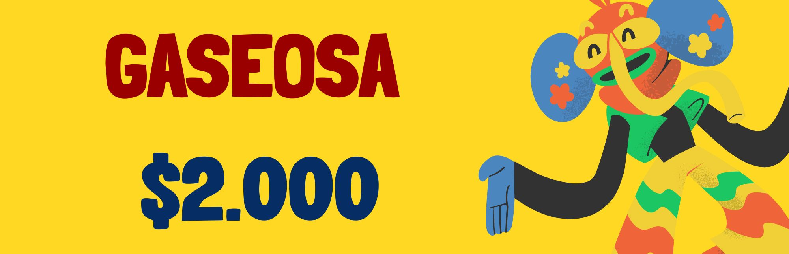
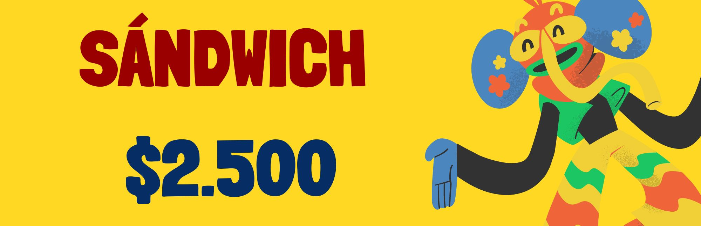
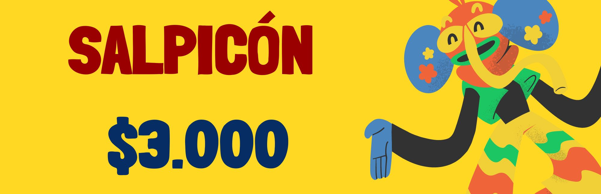

FESTIVAL COMPARSAS 
<!DOCTYPE html>
<html lang="es">
<head>
    <meta charset="UTF-8">
    <meta name="viewport" content="width=device-width, initial-scale=1.0">
    <title>FESTIVAL DE BARRANQUILLA - Gimnasio Los Monjes</title>
    
</head>
<body>
    <h1>FESTIVAL DE COMPARSAS Carnaval de Barranquilla- Gimnasio Los Monjes</h1>
    <h2>Lista de Productos</h2>
    <table>
        <thead>
            <tr>
                <th>Producto</th>
                <th>Existencias</th>
            </tr>
        </thead>
        <tbody>
            <tr>
                <td></td>
                <td>Sí</td>
            </tr>
            <tr>
                <td></td>
                <td>Sí</td>
            </tr>
            <tr>
                <td></td>
                <td>Sí</td>
            </tr>
            <tr>
                <td></td>
                <td>Sí</td>
            </tr>
            <tr>
                <td></td>
                <td>Sí</td>
            </tr>
            <tr>
                <td></td>
                <td>Sí</td>
            </tr>
            <tr>
                <td></td>
                <td>Sí</td>
            </tr>
            <tr>
                <td></td>
                <td>Sí</td>
            </tr>
        </tbody>
    </table>
</body>
</html>
